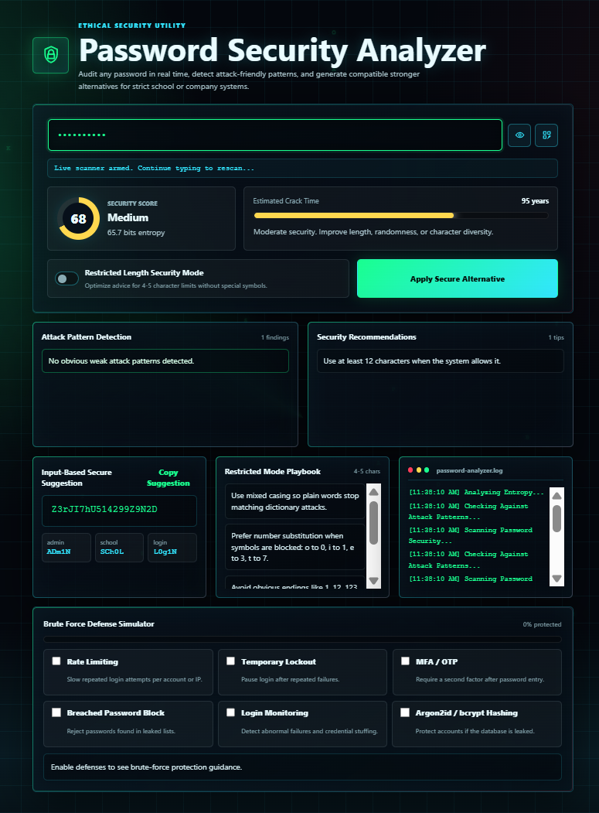
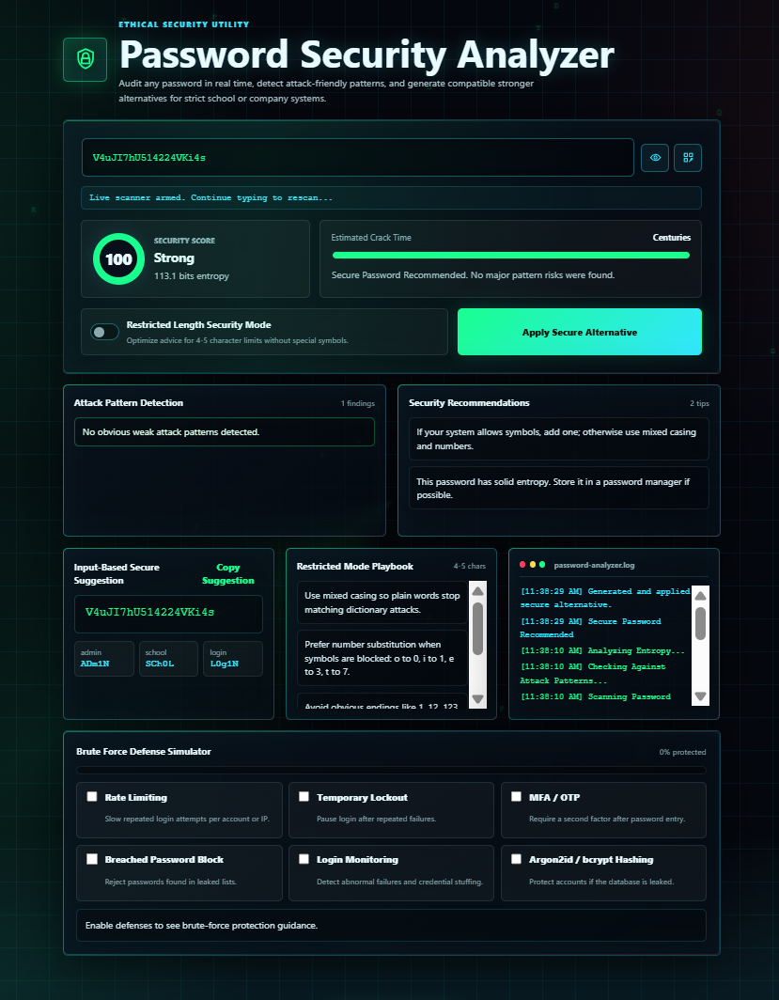
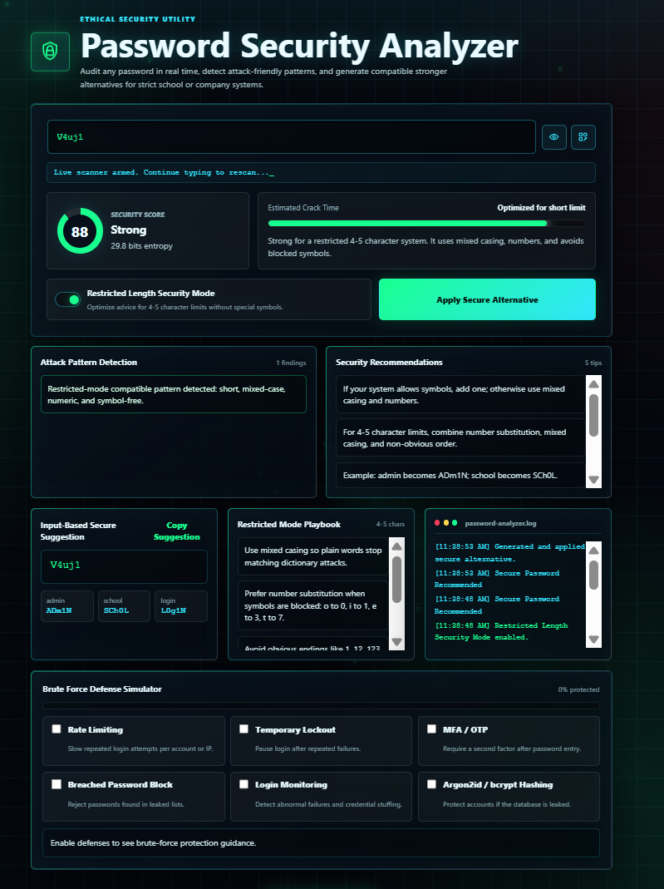
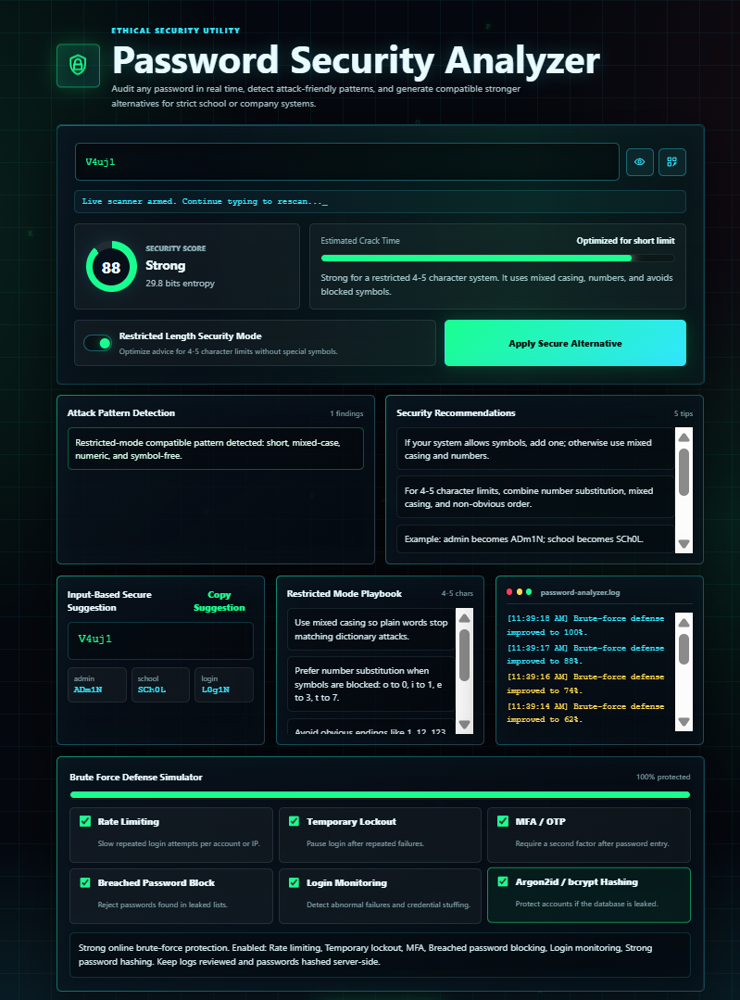

# Password Security Analyzer
<p align=justify>
A simple password security checker built using HTML, CSS, and JavaScript.  
This project analyzes password strength in real time and helps users create safer and stronger passwords.
</p>


---

## Features

- Real-time password strength checking
- Detects weak password patterns
- Shows password score and strength level
- Estimates password crack time
- Gives security tips and recommendations
- Generates strong password suggestions
- Copy password to clipboard
- Cyber-style responsive UI
- Local interactive terminal log

---

## Built With

- HTML5
- CSS3
- JavaScript

---

<h2>Gallery</h2>

<table>
  <tr>
    <td></td>
    <td></td>
    <td></td>
  </tr>
  <tr>
    <td></td>
    <td></td>
  </tr>
</table>

---

## Files

```bash
pass.html
style.css
script.js
